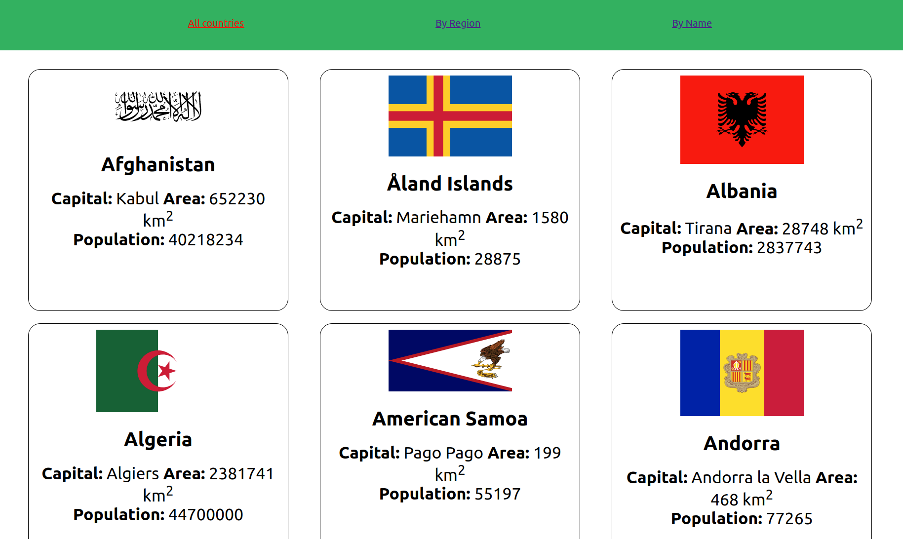
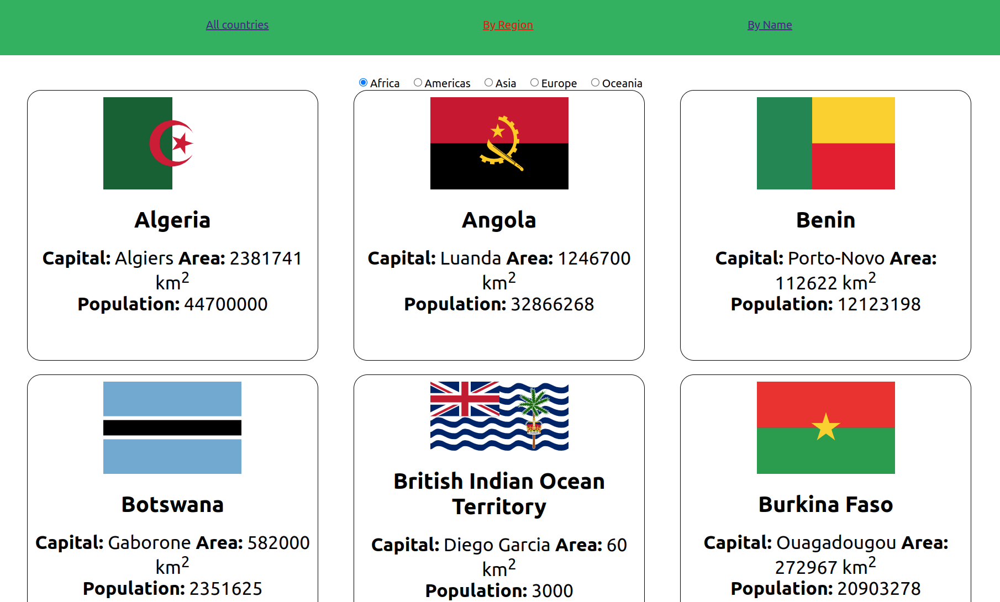
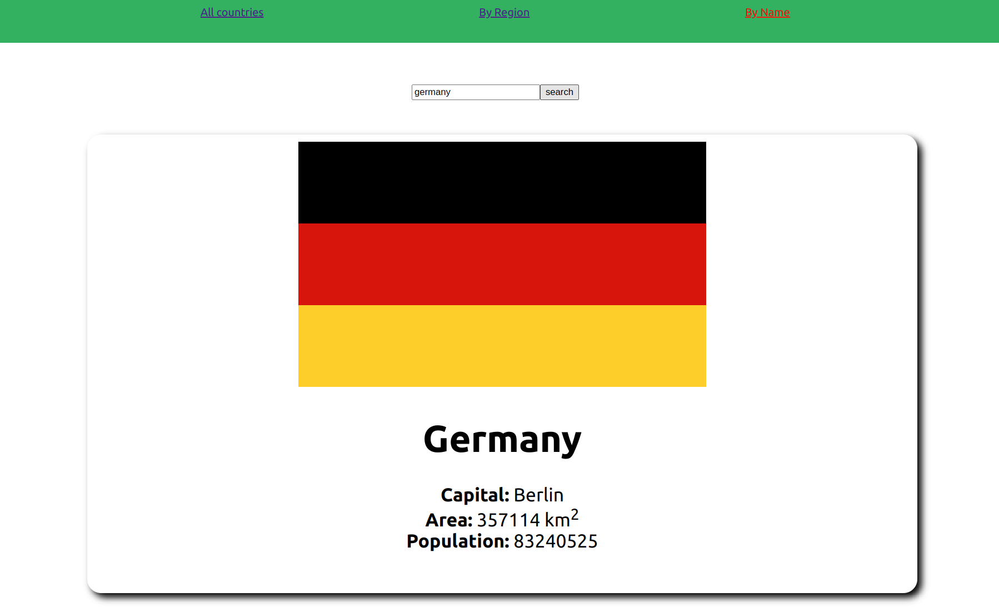
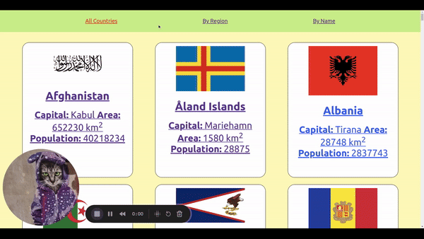
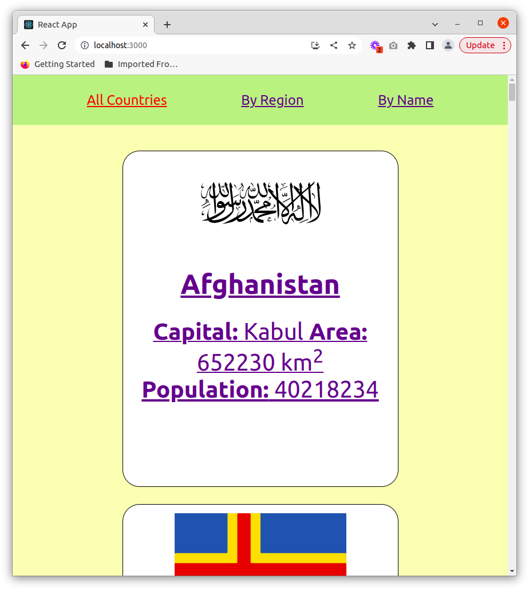

# SPA-Countries-App

## Exercise Course-Module 3 - Single Page Application (SPA) - HTML/CSS/JavaScript/React.js

created at 20.3.23;

Created a responsive React App using different Components with props, React-Router, fetch, React-Hooks, useParams, EventHandler etc....;

The App fetchs and shows all [countries](./assets/my_version_all_countries.png) with some facts of each country, countries filtered by region and also has a search-function, showing the [single country](./assets/my_version_byName.pdf) you typed in. When you click on one country-card on the pages with overviews of "all countries" or "countries by region" it will show you the selected [single country](./assets/my_version_single_country.png).

oriented to the Mockups;

### Mockups:

First Page:

Second Page:

Third Page:

### My Version:

my desktop version:

my mobile version:

